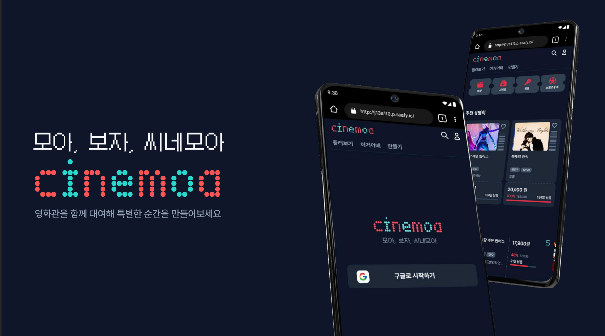

# 씨네모아
> 크라우드 펀딩 기반 영화관 대관 자동화 서비스

# 📜 목차
- [서비스 개요](#서비스-개요)
- [주요 기능](#주요-기능)
- [기술 스택](#기술-스택)
- [아키텍처 구성](#아키텍처-구성)
- [폴더 구조](#폴더-구조)
- [팀원 소개](#팀원-소개)

# 📝서비스 개요
크라우드 펀딩 기반 영화관 대관 자동화 서비스

# ⚡주요 기능

### 1. 영화관/영화 정보 조회 일원화

- 영화관 검색 & 비교: 영화관 대관비, 시설 정보, 좌석 수를 한눈에 조회

- 영화 검색: 영화 정보 DB 조회를 통한 배너 이미지 자동 삽입 및 시놉시스 요약

### 2. 크라우드 펀딩 & 관객 모집/참여

- 목표 설정: 대관비 기반 참가자 결제 금액 자동 결정

- 수요 조사: 펀딩 오픈 전 예상 상영일 구간과 영화관을 지정하고 수요 조사 시행 가능

- 진행률 대시보드: 실시간 펀딩 현황, 참여자 수, 보고싶어요 수, 달성률 시각화

- 보장된 참여: 비관적 락 기반 좌석 점유 -> 결제 -> 해제 흐름을 통한 결제 중 매진 현상 방지

- 관심 영화 등록: 보고싶은 상영회로 지정하여 관심 등록

### 3. 결제 & 정산 시스템

- 모금액 관리 완전 위임: 플랫폼 측에 대금 관리를 위임하여 참가자, 주최자 불안감 해소

- 대금 자동 정산: 펀딩 만기일 도래시 성공 여부에 따라 영화사 계좌로 자동 송금 또는 참가자 계좌로 환불

### 4. 부가 서비스

- 스마트 티켓: 성공한 펀딩에 한해 상영회 당일 본인 확인용 스마트 티켓 제공

- 무빙 포스터: 스마트 티켓에 해당 펀딩의 배너 이미지를 AI를 통해 영상화하여 표시

- 실시간 인기 펀딩: 30분 단위 조회수/보고싶어요 수를 지표로 wilson-score를 계산하여 실시간 인기 펀딩 10개 표시

⭐ 기존에 분산되어 있던 대관 신청-관객 모집-결제-정산 과정을 하나로 통합하여, 대관 수요자들이 안전하고 편리하게 원하는 영화를 함께 모여 볼 수 있는 환경을 제공합니다.

# 🛠기술 스택

### Frontend
- Language: TypeScript
- Framework: Next.js 15
- UI/스타일링: TailwindCSS
- 상태 관리: Zustand

### Backend

- Language: Java 17
- Framework: Spring Boot 3.5.5
- Database: MySQL, Redis
- ORM: JPA
- 인증/보안:Spring Security
- AI : Google Colab(모델 서빙 환경), Wan 2.2(모델)

### Infra 
- Containerization: Docker
- CI/CD: Jenkins

# 📐아키텍처 구성 
### 시스템 아키텍처

# 👥팀원 소개
| 구자원 | 이희경 | 이대연 | 이지우 | 박주희 | 오서로 |
|-------------|--------|--------|--------|--------|--------|
| BE, 팀장         | BE     | FE     | FE     | FS     | FS     |

