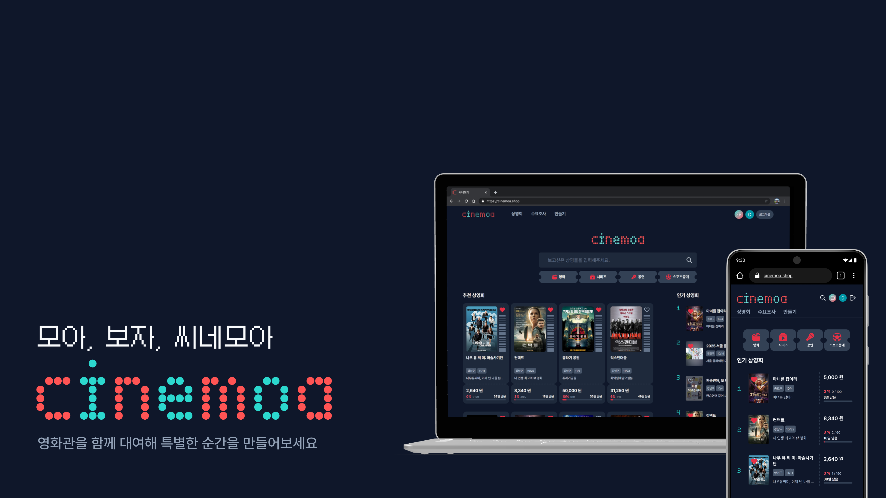
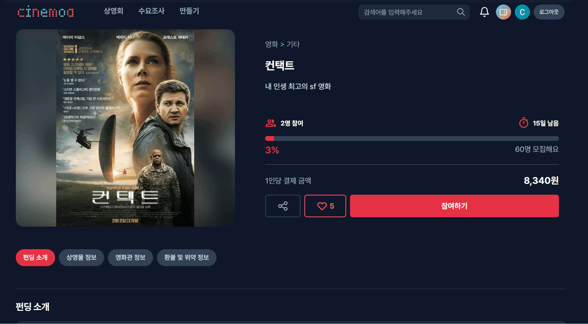
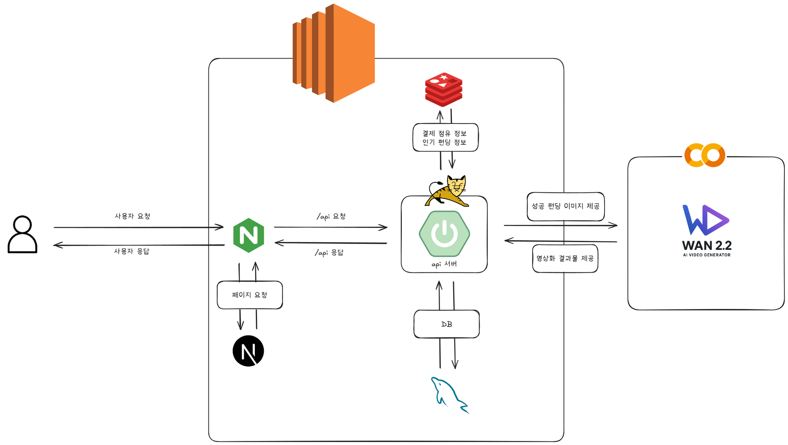

<div align="center">
  <h1 style="display: flex; align-items: center; justify-content: center; width: 100%;">
    씨네모아, Cinemoa
  </h1>
</div>

<br/>

## 📜 목차
1. [서비스 개요](#서비스-개요)
2. [주요 기능](#주요-기능)
3. [기술 스택](#기술-스택)
4. [아키텍처 구성](#아키텍처-구성)
5. [폴더 구조](#-폴더-구조)
6. [팀원 소개](#팀원-소개)
<br/>

## 📝 프로젝트 개요
> **개발 기간** : `2025.08.25 ~ 2025.09.29(4주)`

**씨네모아**는 크라우드 펀딩 기반 **영화관 대관 자동화 서비스**입니다. 
<br/>
기존에 분산되어 있던 대관 신청-관객 모집-결제-정산 과정을 하나로 통합하여, 대관 수요자들이 안전하고 편리하게 원하는 영화를 함께 모여 볼 수 있는 환경을 제공합니다.
<br/>

## ⚡ 핵심 기능

### 1. 상영회
- 필터 : 카테고리, 상영관, 지역별 필터링 기능을 통해 원하는 상영회 조회 가능
- 실시간 인기 펀딩: 30분 마다 조회수/보고싶어요 수를 지표로 wilson-score를 계산
- 진행률 대시보드: 실시간 펀딩 현황, 참여자 수, 보고싶어요 수, 달성률 시각화
- 검색 : 상영물, 상영회 제목으로 검색하여 상영회 조회 가능
 
| 실시간 인기 상영회 |
| :---: |
| <p align="center"></p> |

| 상영회 조회|
| :---: |
| <p align="center"></p> |

| 검색|
| :---: |
| <p align="center"></p> |


### 2. 수요 조사 
- 수요 조사: 상영회 개설 전 예상 대관일 구간과 영화관을 지정하고 수요 예측 제공
- 상영회 전환 : 완료된 수요 조사는 기존 내용을 바탕으로 수요 조사 전환 제공

| 수요 조사 |
| :---: |
| <p align="center"></p> |

| 상영회 전환|
| :---: |
| <p align="center"></p> |


### 3. 만들기 
- 크라우드 펀딩 기반 참여자 모집 : 대관비 기반 참가자 결제 금액 자동 결정
- 영화 검색 : 상영물 검색 결과를 통한 배너 이미지 자동 삽입 및 AI 상세 소개 요약
- 영화관 검색 : 영화관 대관비, 시설 정보를 한 눈에 조회

| 영화 검색 |
| :---: |
| <p align="center"></p> |

| 영화관 검색|
| :---: |
| <p align="center"></p> |


### 4. 참여하기
- 좌석 점유 / 결제 로직 분리 : 3분간 임시 좌석 점유 -> 결제 -> 참여
- 모금액 관리 완전 위임: 플랫폼 측에 대금 관리를 위임하여 참가자, 주최자 불안감 해소
- 대금 자동 정산: 펀딩 성공 여부에 따라 영화사 계좌로 자동 송금 또는 참가자 계좌로 환불

| 상영회 참석 및 결제|
| :---: |
| <p align="center"></p> |


### 5. 반응형 레이아웃
- 네비게이션 메뉴바와 인기 상영회 리스트의 경우 desktop(1024px)을 기준으로 그 이상일 경우 1줄, 이하일 경우 2로 변경
- 각 상영회 카드는 desktop(1024px)을 기준으로 그 이상일 경우 세로, 이하일 경우 가로 변경
  
| 반응형 레이아웃|
| :---: |
| <p align="center"></p> |


### 6. 스마트 티켓
- 스마트 티켓: 성공한 펀딩은 배너 이미지를 AI를 통해 영상화하여 스마트 티켓 제공

| AI 스마트 티켓|
| :---: |
| <p align="center"></p> |


## ⚙️ 기술 스택

### Frontend
- Language: TypeScript
- Framework: Next.js 15
- UI/스타일링: TailwindCSS
- 상태 관리: Zustand

### Backend

- Language: Java 17
- Framework: Spring Boot 3.5.5
- Database: MySQL, Redis
- ORM: JPA
- 인증/보안:Spring Security
- AI : Google Colab(모델 서빙 환경), Wan 2.2(모델)

### Infra 
- Containerization: Docker
- CI/CD: Jenkins

## 📐아키텍처 구성 
### 시스템 아키텍처


## 📂 폴더 구조
```
📂 backend
    ㄴ Spring boot project
    ㄴ 🐳 Dockerfile
📂 frontend
    ㄴ Next.js project
    ㄴ 🐳 Dockerfile
📃 Jenkinsfile
```

## 👥팀원 소개
| 구자원 | 이희경 | 이대연 | 이지우 | 박주희 | 오서로 |
|-------------|--------|--------|--------|--------|--------|
| BE, 팀장         | BE     | FE     | FE     | FS     | FS     |


